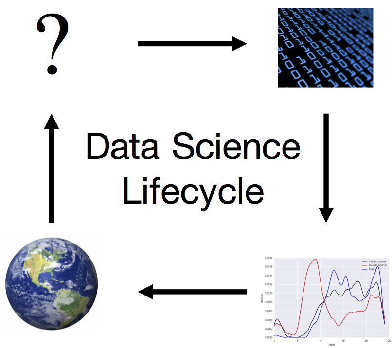



<!-- # DS100: Principles & Techniques of Data Science -->

Combining data, computation, and inferential thinking, data science is redefining how people and organizations solve challenging problems and understand the world.
This intermediate level class bridges between [Data 8](http://data8.org/fa16/) and upper division computer science and statistics courses as well as methods courses in other fields.

In this class, students explore the data science lifecycle, including question formulation, data collection and cleaning, exploratory data analysis and visualization, statistical inference and prediction​, and decision-making.​ This class focuses on quantitative critical thinking​ and key principles and techniques needed to carry out this cycle. These include languages for transforming, querying and analyzing data; algorithms for machine learning methods including regression, classification and clustering; principles behind creating informative data visualizations; statistical concepts of measurement error and prediction; and techniques for scalable data processing.

_Lectures are Tuesdays and Thursdays from 12:30 to 2:00 in Soda 306_

{:height="200px"}
<!--  -->

**[*Tentative* Syllabus](syllabus)**

If you have enrolled in the wait-list please complete the following  <a href="https://goo.gl/forms/Ku5cu7L7cUbSaTKc2">Background Survey</a> we will use this to help in admitting students into the class.

### Goals

* **Prepare** students for advanced Berkeley courses in data-management ([CS186](http://www.cs186berkeley.net)), machine learning [CS189](https://people.eecs.berkeley.edu/~jrs/189/)), and statistics ([Stat-154](http://www.stat.berkeley.edu/~rabbee/s154/)), by providing the necessary foundation and context

* **Enable** students to start careers as data scientists by providing experience in working with real-world data, tools, and techniques

* **Empower** student to apply computational and inferential thinking to tackle real-world problems

## Context

This course is a gateway to upper division courses in both the foundations and the application of data science principles and techniques.
We expect that DS100 will be widely enrolled by students in many majors, as well as graduate students in many fields.
In this first offering of the class we will keep enrollment relatively small, around 98, to enable closer interaction with students as challenges arise.  We expect later offerings to be substantially larger.

## Prerequisites

While we are working to make this class widely accessible in the initial ([beta](https://en.wikipedia.org/wiki/Software_release_life_cycle)) version of the class we plan to require the following (or equivalent):

1. **Foundations of Data Science:** [**Data8**](http://data8.org/fa16/) covers much of the material in DS100 but at an introductory level.  Data8 provides basic exposure to python programming and working with tabular data as well as visualization, statistics, and machine learning.

1. **Computing:** *The Structure and Interpretation of Computer Programs* [**CS61a**](http://cs61a.org) or *Computational Structures in Data Science* [**CS88**](http://cs88-website.github.io).   These courses provide additional background in python programming (e.g., *for loops*, *lambdas*, *debugging*, and *complexity*) that will enable DS100 to focus more on the concepts in Data Science and less on the details of programming in python.

1. **Math:** *Linear Algebra* ([Math 54](https://math.berkeley.edu/~nadler/54fall2015.html) or [EE 16a](http://inst.eecs.berkeley.edu/~ee16a/fa16/)): We will need some basic concepts like linear operators, eigenvectors, derivatives, and integrals to enable statistical inference and derive new prediction algorithms.  This may be satisfied concurrently to DS100.

## Textbooks

Because data science is a relatively new and rapidly evolving discipline there is no single *ideal* textbook for the course.
Instead we plan to use reading from a collection of books all of which are free.
However, we have listed a few optional books that will provide additional context for those who are interested.

#### Primary Books
* **[Introduction to Statistical Learning:](http://www-bcf.usc.edu/~gareth/ISL/)** (Free online PDF) This book is a great reference for the machine learning and some of the statistics material in the class

* **[Data Science from Scratch:](http://shop.oreilly.com/product/0636920033400.do)** (Free to Berkeley students) This more applied book covers many of the topics in this class using Python but doesn't go into sufficient depth for some of the more mathematical material.

#### Secondary Books
*  **[Doing Data Science:](http://shop.oreilly.com/product/0636920028529.do)** This books provides a unique case-study view of data science but uses R and not Python. 

## Instructors

<!-- The following block is for faculty info -->

  
  

    

      
      <address>
        <strong>Joseph E. Gonzalez</strong> 
        
      </address>
    

    

      
      <address>
        <strong>Joseph Hellerstein</strong> 
        
      </address>
    

    

      
      <address>
        <strong>Deborah Nolan</strong> 
        
      </address>
    

    

      
      <address>
        <strong>Bin Yu</strong> 
        
      </address>
    

  

## Grading

There will be 7 challenging homeworks assignments.  Homeworks must be completed individually and will mix programming and short answer questions.  At the end of each week of instruction we will have an online multiple choice quiz that will help you stay up-to-date with lecture materials. Labs assignments will be graded for completion and are intended to help with the homework assignments. 

* 40% Homeworks 
* 13% Vitamins 
* 7% Labs
* 15% Midterm
* 25% Final 

### Collaboration Policy

Data science is a collaborative activity.  While you may talk with others about the homework, we ask that you write your solutions individually.  If you do discuss the assignments with others please include their names at the top of your solution.
Keep in mind that content from the homework and vitamins will likely be covered on both the midterm and final.

